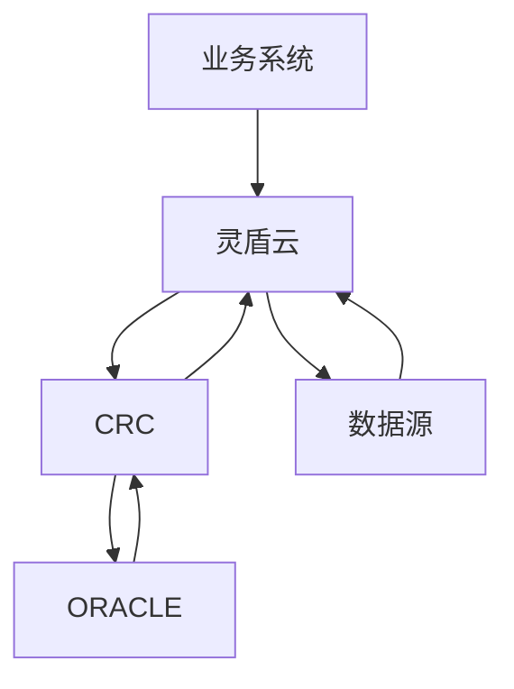
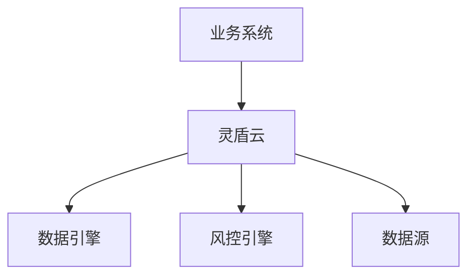

项目改造为SpringCloud

老版灵盾云：
灵盾云转发请求到数据源或者CRC，
CRC-风控数据清洗引擎作为链接ORACLE和业务的桥梁，
1、多个数据源、CRC、灵盾云皆相同的环境，使用SpringCloud保证多个项目使用统一份配置文件

拆分：
1. 转发（拆出，保证灵盾云功能迭代时不会影响转发的功能）
2. 计费（定时10分钟读取merchant数据，计费）
3. 商户、服务包、服务项功能（这个低频操作，没必要拆）

后续将CRC重构为数据引擎+风控引擎

拆分的好处：
1. 满足快速迭代，灵盾云的改动建立在商户相关服务中，对转发+计费并没有调整，新功能上线时不应该干扰
2. 原操作是在灵盾云做统一转发，即数据引擎对数据源的调用也发送一次http到灵盾，再由灵盾发送http到数据源，两次http耗费资源
3. 无需考虑事务和查询，应为只是作为转发

API Gateway负责负载均衡、缓存、访问控制、API 计费监控等等任务，可以通过NGINX方便实现，后续文章将会介绍到API Gateway。